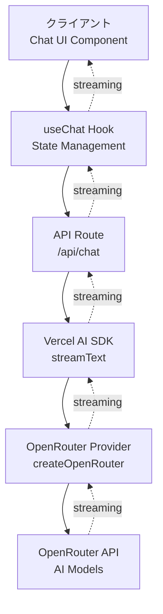
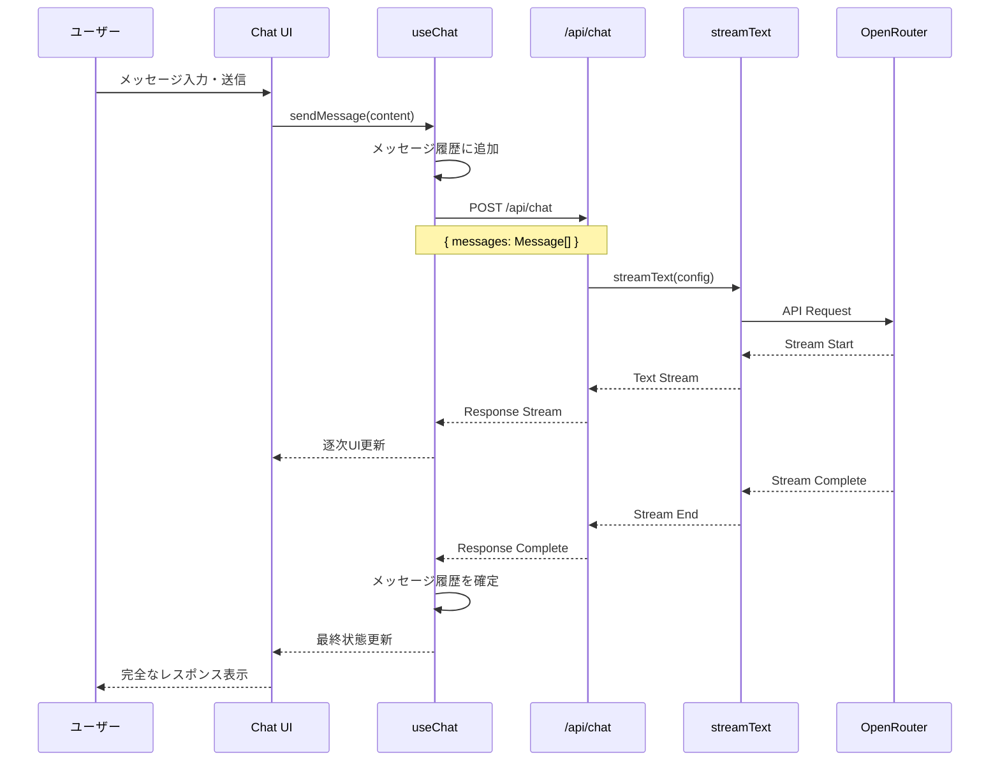
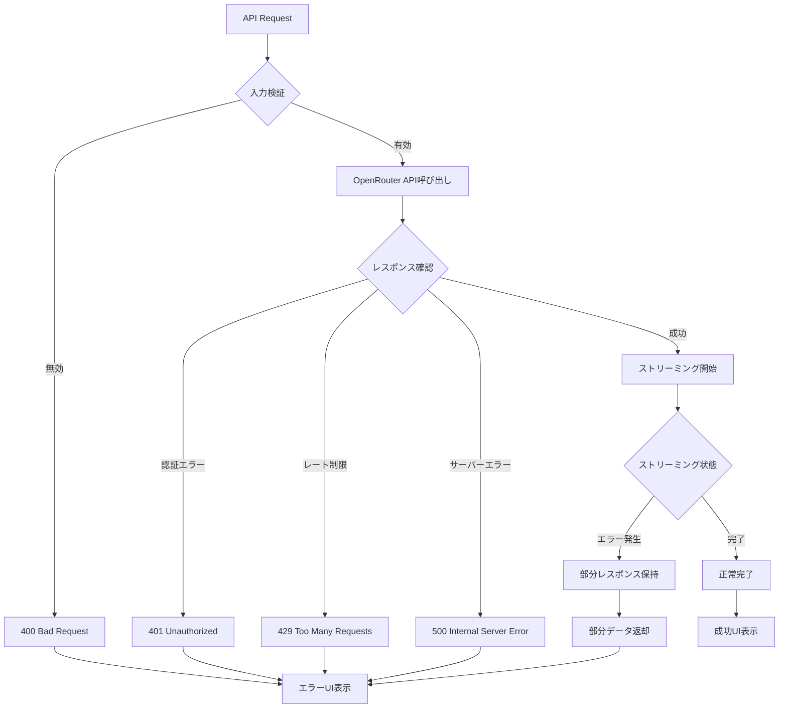

# 技術設計ドキュメント

## 概要

OpenRouterとVercel AI SDK 5.0を統合したチャットアプリケーションを構築する。ユーザーはWebインターフェースを通じてAIモデルと対話し、ストリーミング形式でリアルタイムにレスポンスを受け取る。本機能はNext.js 15.5のApp Routerをベースに、クライアントサイドとサーバーサイドを適切に分離した構成で実現する。

### ゴール
- ストリーミングレスポンスによる自然な対話体験の提供
- OpenRouter経由で複数のAIモデルへアクセス可能な統合環境の構築
- 会話履歴を維持したコンテキストベースの対話の実現

### 非ゴール
- 複数チャットセッションの同時管理
- チャット履歴の永続化（データベース保存）
- ユーザー認証・アカウント管理機能
- 高度なチャット機能（ファイル添付、画像生成など）

## アーキテクチャ

### 全体アーキテクチャ



### 技術スタック選定と設計判断

**フロントエンド層**:
- **選定**: React 19.1 + Next.js 15.5 (App Router)
- **根拠**: 既存プロジェクトの基盤技術。RSC（React Server Components）とクライアントコンポーネントの分離により、UIとAPI処理の責務を明確化
- **代替案**: Pages Routerは検討したが、App Routerの方がRoute Handlersとの統合が自然で、ストリーミングレスポンスの実装が容易

**AI統合層**:
- **選定**: Vercel AI SDK 5.0 (`ai` + `@ai-sdk/react`)
- **根拠**: useChat hookによるストリーミング状態管理の自動化、streamTextによる統一的なストリーミングAPI、型安全性の確保
- **代替案**: OpenRouter REST APIの直接利用も検討したが、ストリーミング処理の複雑性とエラーハンドリングのボイラープレートを考慮してAI SDKを採用

**AI Provider層**:
- **選定**: `@openrouter/ai-sdk-provider`
- **根拠**: 公式OpenRouterプロバイダーであり、数百のモデルへの統一的なアクセスを提供。Vercel AI SDKとのネイティブ統合
- **代替案**: 個別のモデルプロバイダー（OpenAI SDK等）は、複数モデルへのアクセス要件に対して柔軟性が低い

**スタイリング層**:
- **選定**: Tailwind CSS 4
- **根拠**: 既存プロジェクトで採用済み。ユーティリティファーストアプローチによる迅速なUI構築
- **代替案**: CSS Modules、styled-componentsは検討したが、既存スタックとの一貫性を優先

### 主要設計判断

#### 判断1: useChat Hook + API Route分離アーキテクチャ

**判断**: クライアントサイドでuseChat hookを使用し、サーバーサイドのAPI RouteでstreamTextを実行する分離型アーキテクチャを採用

**コンテキスト**: AI SDK 5.0はクライアント直接統合も可能だが、APIキーの保護とサーバーサイド処理の必要性から分離が求められる

**代替案**:
1. クライアント直接統合: APIキーが露出するセキュリティリスク
2. Server Actions使用: ストリーミングレスポンスとの統合が複雑化
3. 選定アプローチ: API Route + useChat hookの組み合わせ

**選定アプローチ**: API Route（`/api/chat`）でstreamTextを実行し、useChatがそのエンドポイントを呼び出す構成

**根拠**:
- APIキーをサーバーサイドで安全に管理
- useChatの自動ストリーミング処理を活用
- Next.jsのRoute Handlersとの自然な統合

**トレードオフ**:
- 獲得: セキュリティの確保、AI SDK機能のフル活用、保守性の向上
- 犠牲: クライアント直接統合と比較した若干のレイテンシ増加（実用上は無視可能）

#### 判断2: クライアント状態管理にuseState使用

**判断**: 会話履歴とUI状態の管理にReactのuseStateを使用し、外部状態管理ライブラリを導入しない

**コンテキスト**: チャットアプリケーションは単一ページ内で完結し、複雑な状態共有は不要

**代替案**:
1. Zustand/Redux導入: 過剰な複雑性の追加
2. Context API使用: 現時点でグローバル状態の必要性なし
3. 選定アプローチ: useChatとuseStateの組み合わせ

**選定アプローチ**: useChatが提供する状態管理に加え、必要に応じてuseStateで追加状態を管理

**根拠**:
- useChatがメッセージ・ストリーミング状態を自動管理
- 追加状態（UI表示制御等）はuseStateで十分
- ライブラリ依存の最小化

**トレードオフ**:
- 獲得: シンプルさ、学習コストの低さ、バンドルサイズの削減
- 犠牲: 将来的に複雑な状態管理が必要になった場合の移行コスト（現時点では不要と判断）

#### 判断3: TypeScript厳格型定義の徹底

**判断**: メッセージ型、エラー型、API契約すべてに明示的な型定義を適用し、`any`型の使用を禁止

**コンテキスト**: AI SDKはジェネリックな型を提供するが、アプリケーション固有の型定義が必要

**代替案**:
1. 緩い型定義（any使用）: ランタイムエラーのリスク増加
2. 部分的型定義: 型安全性の不完全性
3. 選定アプローチ: 完全な型定義

**選定アプローチ**: Message、ChatRequest、ChatResponse、ErrorTypeなど全ての型を明示的に定義

**根拠**:
- コンパイル時のエラー検出
- IDEによる補完とドキュメント機能の向上
- リファクタリングの安全性確保

**トレードオフ**:
- 獲得: 型安全性、保守性、開発体験の向上
- 犠牲: 初期開発時の型定義作成コスト（長期的には投資対効果が高い）

## システムフロー

### ユーザーメッセージ送信フロー



### エラーハンドリングフロー



## 要件トレーサビリティ

| 要件 | 要件概要 | コンポーネント | インターフェース | フロー |
|------|----------|----------------|------------------|--------|
| 1.1-1.4 | チャットインターフェース | ChatUI Component | useChat hook, ChatMessage型 | ユーザーメッセージ送信フロー |
| 2.1-2.4 | AIレスポンス生成 | ChatRouteHandler | POST /api/chat, streamText() | ユーザーメッセージ送信フロー |
| 3.1-3.4 | ストリーミングレスポンス | StreamingManager | StreamingResponse, useChat状態 | ユーザーメッセージ送信フロー |
| 4.1-4.4 | OpenRouter統合 | OpenRouterProvider | createOpenRouter(), 環境変数 | ユーザーメッセージ送信フロー |
| 5.1-5.4 | セッション管理 | MessageStore | Message[], useChat messages | ユーザーメッセージ送信フロー |

## コンポーネントとインターフェース

### フロントエンド層

#### ChatUI Component

**責務と境界**
- **主要責務**: チャットインターフェースのレンダリングとユーザーインタラクション処理
- **ドメイン境界**: プレゼンテーション層（UI/UX）
- **データ所有**: UI状態（入力値、表示制御フラグ等）のみ。メッセージデータはuseChat hookが所有
- **トランザクション境界**: なし（読み取り専用コンポーネント、副作用はhookに委譲）

**依存関係**
- **Inbound**: なし（ルートコンポーネント）
- **Outbound**: useChat hook、MessageList Component、ChatInput Component
- **External**: `@ai-sdk/react` (useChat)

**契約定義**

**コンポーネントインターフェース**:
```typescript
interface ChatUIProps {
  // 初期設定（将来的な拡張用）
  initialMessages?: Message[];
  modelName?: string;
}

interface Message {
  id: string;
  role: 'user' | 'assistant' | 'system';
  content: string;
  createdAt?: Date;
}

interface UseChatReturn {
  messages: Message[];
  status: 'ready' | 'submitted' | 'streaming' | 'error';
  sendMessage: (message: string) => void;
  stop: () => void;
  regenerate: () => void;
  error?: Error;
}
```

**状態管理**:
- **ローカル状態**: 入力フィールドの値（`inputValue: string`）
- **Hook状態**: messages、status、error（useChatが管理）
- **永続化**: なし（セッションストレージ等は将来的な拡張）
- **並行制御**: React 19の自動バッチング機能を活用

#### MessageList Component

**責務と境界**
- **主要責務**: メッセージ配列の表示とスクロール制御
- **ドメイン境界**: プレゼンテーション層（表示専用）
- **データ所有**: なし（Propsとして受け取る）
- **トランザクション境界**: なし

**依存関係**
- **Inbound**: ChatUI Component
- **Outbound**: MessageItem Component
- **External**: なし

**契約定義**

**コンポーネントインターフェース**:
```typescript
interface MessageListProps {
  messages: Message[];
  isStreaming: boolean;
}
```

**不変条件**: メッセージは時系列順にソート済みであること

#### ChatInput Component

**責務と境界**
- **主要責務**: ユーザー入力の受付と送信トリガー
- **ドメイン境界**: プレゼンテーション層（入力制御）
- **データ所有**: 入力中のテキスト値
- **トランザクション境界**: なし

**依存関係**
- **Inbound**: ChatUI Component
- **Outbound**: なし
- **External**: なし

**契約定義**

**コンポーネントインターフェース**:
```typescript
interface ChatInputProps {
  value: string;
  onChange: (value: string) => void;
  onSubmit: (message: string) => void;
  disabled: boolean;
  placeholder?: string;
}
```

**事前条件**: `disabled`がfalseの場合のみ送信可能
**事後条件**: 送信成功後、入力値は空文字列にリセット

### バックエンド層

#### ChatRouteHandler

**責務と境界**
- **主要責務**: チャットAPIリクエストの処理とストリーミングレスポンスの生成
- **ドメイン境界**: APIレイヤー（HTTPリクエスト/レスポンス処理）
- **データ所有**: リクエスト検証ロジック
- **トランザクション境界**: 単一リクエスト単位（ステートレス）

**依存関係**
- **Inbound**: ChatUI Component (useChat hook経由)
- **Outbound**: streamText（Vercel AI SDK）、OpenRouterProvider
- **External**:
  - `ai` (streamText)
  - `@openrouter/ai-sdk-provider` (createOpenRouter)
  - Next.js Route Handler API

**外部依存調査**:

**Vercel AI SDK (`ai`)**:
- **公式ドキュメント**: https://ai-sdk.dev/docs/reference/ai-sdk-core/stream-text
- **主要API**: `streamText(options): StreamTextResult`
  - `options.model`: AI providerモデルインスタンス
  - `options.messages`: 会話履歴配列
  - `options.system`: システムプロンプト（オプション）
- **レスポンス**: StreamTextResultはtoDataStreamResponse()でResponse型に変換
- **エラー処理**: APIエラーはストリーム内でエラーチャンクとして返却
- **バージョン**: 5.0.60（package.jsonで確認済み）

**OpenRouter AI SDK Provider (`@openrouter/ai-sdk-provider`)**:
- **公式ドキュメント**: https://openrouter.ai/docs/community/vercel-ai-sdk
- **認証方式**: Bearer token（環境変数 `OPENROUTER_API_KEY`）
- **初期化**: `createOpenRouter({ apiKey: string })`
- **モデル指定**: `openrouter(modelName: string)` - 例: `'anthropic/claude-3.7-sonnet:thinking'`
- **レート制限**: OpenRouter側で管理（429エラーで通知）
- **使用量トラッキング**: レスポンスヘッダーで利用状況を返却
- **バージョン**: 1.2.0（package.jsonで確認済み）
- **バージョン互換性**: Vercel AI SDK 5.x系と互換性確認済み

**契約定義**

**API Contract**:
| Method | Endpoint | Request | Response | Errors |
|--------|----------|---------|----------|--------|
| POST | /api/chat | ChatRequest | StreamingTextResponse | 400, 401, 429, 500 |

**Request Schema**:
```typescript
interface ChatRequest {
  messages: Message[];
}

interface Message {
  role: 'user' | 'assistant' | 'system';
  content: string;
}
```

**Response Schema**:
```typescript
// ストリーミングレスポンス: text/event-stream
// 各チャンク: data: {token: string, ...metadata}\n\n
// 最終チャンク: data: [DONE]\n\n

type StreamingTextResponse = Response; // Content-Type: text/event-stream
```

**Error Schema**:
```typescript
interface ErrorResponse {
  error: {
    message: string;
    type: 'validation_error' | 'authentication_error' | 'rate_limit_error' | 'api_error';
    code: string;
  };
}
```

**事前条件**:
- リクエストボディが有効なJSON形式
- messagesが非空配列
- 各メッセージがroleとcontentを持つ

**事後条件**:
- ストリーミングレスポンスが開始される
- エラー時は適切なHTTPステータスコードとエラーメッセージを返す

**不変条件**:
- 環境変数 `OPENROUTER_API_KEY` が設定済み
- OpenRouterプロバイダーインスタンスは再利用可能（シングルトン推奨）

#### OpenRouterProvider

**責務と境界**
- **主要責務**: OpenRouterインスタンスの初期化と管理
- **ドメイン境界**: インフラストラクチャ層（外部サービス統合）
- **データ所有**: APIキー、モデル設定
- **トランザクション境界**: なし（プロバイダー初期化のみ）

**依存関係**
- **Inbound**: ChatRouteHandler
- **Outbound**: OpenRouter API
- **External**: `@openrouter/ai-sdk-provider`

**契約定義**

**サービスインターフェース**:
```typescript
interface OpenRouterConfig {
  apiKey: string;
  baseURL?: string; // デフォルト: https://openrouter.ai/api/v1
}

interface OpenRouterProviderService {
  initialize(config: OpenRouterConfig): OpenRouterInstance;
  getModel(modelName: string): ModelInstance;
}

type OpenRouterInstance = ReturnType<typeof createOpenRouter>;
type ModelInstance = ReturnType<OpenRouterInstance>;
```

**事前条件**: 有効なAPIキーが環境変数に設定されている
**事後条件**: 初期化されたOpenRouterインスタンスを返す
**不変条件**: APIキーは環境変数からのみ読み込み、コード内にハードコードしない

**統合戦略**:
- **アプローチ**: 新規実装（既存システムなし）
- **初期化タイミング**: API Route内で遅延初期化（関数レベルスコープ）
- **将来的な最適化**: グローバルシングルトン化によるインスタンス再利用

## データモデル

### ドメインモデル

**コアコンセプト**:

**Entities（エンティティ）**:
- **ChatMessage**: 一意のIDを持つ会話メッセージ
  - 識別子: `id: string` (UUID推奨)
  - ライフサイクル: 作成後は不変（Immutable）
  - 所有権: ChatSession

**Value Objects（値オブジェクト）**:
- **MessageRole**: メッセージの役割を表す不変値（'user' | 'assistant' | 'system'）
- **MessageContent**: メッセージ本文（string、将来的にマルチモーダル対応の可能性）
- **StreamingStatus**: ストリーミング状態（'ready' | 'submitted' | 'streaming' | 'error'）

**ビジネスルールと不変条件**:
- 会話メッセージは時系列順に並ぶこと
- ユーザーメッセージの後には必ずアシスタントメッセージが続く（エラー時を除く）
- システムメッセージは会話の先頭にのみ配置可能
- 空のメッセージコンテンツは許容しない

### 論理データモデル

**構造定義**:

```typescript
interface ChatMessage {
  id: string;
  role: MessageRole;
  content: string;
  createdAt: Date;
}

type MessageRole = 'user' | 'assistant' | 'system';

interface ChatSession {
  messages: ChatMessage[];
  status: StreamingStatus;
  error?: ChatError;
}

type StreamingStatus = 'ready' | 'submitted' | 'streaming' | 'error';

interface ChatError {
  message: string;
  type: ErrorType;
  code: string;
}

type ErrorType =
  | 'validation_error'
  | 'authentication_error'
  | 'rate_limit_error'
  | 'api_error';
```

**一貫性と整合性**:
- **トランザクション境界**: 各APIリクエストは独立したトランザクション（ステートレス）
- **参照整合性**: なし（永続化レイヤーなし）
- **時間的側面**: `createdAt`によるメッセージの時系列順序保証

### データ契約とインテグレーション

**API Data Transfer**:

```typescript
// POST /api/chat Request
interface ChatAPIRequest {
  messages: {
    role: 'user' | 'assistant' | 'system';
    content: string;
  }[];
}

// POST /api/chat Response (Streaming)
// Content-Type: text/event-stream
// Format: Server-Sent Events (SSE)
```

**検証ルール**:
- `messages`: 必須、非空配列
- `messages[].role`: 必須、列挙値のいずれか
- `messages[].content`: 必須、非空文字列、最大長100,000文字

**シリアライゼーション形式**: JSON（リクエスト）、Server-Sent Events（レスポンス）

**クロスサービスデータ管理**:
- **パターン**: ステートレスAPI（永続化なし）
- **データ同期**: なし（クライアント側で状態管理）
- **結果整合性**: なし（即時一貫性）

## エラーハンドリング

### エラー戦略

APIレイヤーとクライアントレイヤーで異なるエラー処理戦略を採用する。APIレイヤーでは構造化されたエラーレスポンスを返却し、クライアントレイヤーでは適切なUI表示と回復手段を提供する。

### エラーカテゴリとレスポンス

**ユーザーエラー（4xx）**:

| エラー種別 | HTTPステータス | 処理 |
|-----------|---------------|------|
| 無効な入力形式 | 400 Bad Request | リクエストボディのバリデーションエラー詳細を返却 |
| 認証エラー | 401 Unauthorized | APIキー設定の確認を促すメッセージ |
| メッセージが空 | 400 Bad Request | 必須フィールドのエラーメッセージ |

**UIレスポンス**: フォームフィールド近辺にインラインエラーメッセージを表示

**システムエラー（5xx）**:

| エラー種別 | HTTPステータス | 処理 |
|-----------|---------------|------|
| OpenRouter APIエラー | 502 Bad Gateway | 外部サービスエラーとして記録し、一般的なエラーメッセージを返却 |
| タイムアウト | 504 Gateway Timeout | 再試行を促すメッセージ |
| 内部サーバーエラー | 500 Internal Server Error | エラーログを記録し、一般的なエラーメッセージを返却 |

**UIレスポンス**: トーストまたはバナーでシステムエラーを通知し、再試行ボタンを提供

**ビジネスロジックエラー（422）**:

| エラー種別 | HTTPステータス | 処理 |
|-----------|---------------|------|
| レート制限超過 | 429 Too Many Requests | 待機時間と再試行タイミングを通知 |
| モデル利用不可 | 422 Unprocessable Entity | 利用可能なモデルリストへの誘導 |

**UIレスポンス**: エラー原因と解決手順をダイアログで表示

### 監視

**エラー追跡**:
- コンソールログによる開発環境でのエラー出力
- 将来的な拡張: Sentry等のエラー追跡サービス統合

**ログ記録**:
- API Route内でのエラーログ記録（`console.error`）
- ログ項目: タイムスタンプ、エラータイプ、メッセージ、スタックトレース

**ヘルスモニタリング**:
- 現時点では実装なし
- 将来的な拡張: `/api/health` エンドポイントによるヘルスチェック

## テスト戦略

### ユニットテスト

**ChatUI Component**:
- メッセージ配列が正しくレンダリングされるか
- 送信ボタンクリック時にonSubmitが呼ばれるか
- ストリーミング中は送信ボタンが無効化されるか
- エラー状態が正しく表示されるか

**ChatRouteHandler**:
- 有効なリクエストでstreamTextが呼ばれるか
- 無効なリクエストで400エラーが返却されるか
- APIキー未設定時に500エラーが返却されるか

**バリデーション関数**:
- 空のメッセージ配列で検証が失敗するか
- 不正なrole値で検証が失敗するか
- 有効なメッセージで検証が成功するか

### 統合テスト

**API Route + OpenRouter統合**:
- POST /api/chatが正しくストリーミングレスポンスを返すか
- OpenRouter APIエラー時に適切なエラーレスポンスを返すか
- メッセージ履歴が正しくOpenRouterに送信されるか

**useChat + API Route統合**:
- sendMessage実行時にAPIが呼ばれメッセージが追加されるか
- ストリーミング中に状態が正しく更新されるか
- エラー発生時にerror状態がセットされるか

### E2Eテスト

**チャット送信フロー**:
- ユーザーがメッセージを入力し送信できるか
- AIレスポンスがストリーミング表示されるか
- 会話履歴が正しく表示されるか

**エラーハンドリング**:
- APIエラー時にエラーメッセージが表示されるか
- 再試行ボタンで再送信できるか

**UI/UX**:
- モバイルビューで正しくレイアウトされるか
- ローディング状態が視覚的に明確か

### パフォーマンステスト

**ストリーミングレスポンス**:
- 初回トークン到達時間（TTFB）が1秒以内か
- 大量メッセージ履歴（100件以上）でもUIが滑らかに動作するか

**並行処理**:
- 複数ユーザーの同時アクセスでサーバーが安定動作するか

## セキュリティ考慮事項

**認証と認可**:
- OpenRouter APIキーは環境変数（`OPENROUTER_API_KEY`）で管理
- クライアントサイドへのAPIキー露出を防止（API Route経由で利用）

**データ保護とプライバシー**:
- 会話データの永続化なし（メモリ内のみ）
- 第三者サービス（OpenRouter）へのデータ送信についてプライバシーポリシーで明記推奨

**脅威モデリング**:
- **XSS攻撃**: Reactのデフォルトエスケープ機能で防御、ユーザー入力のサニタイゼーションは不要
- **CSRF攻撃**: Next.jsのSameSite cookie設定で防御
- **APIキー漏洩**: 環境変数管理とサーバーサイド実行で防御

**セキュリティ制御**:
- 環境変数の `.env.local` による管理（`.gitignore` 登録必須）
- Content Security Policy (CSP) ヘッダーの設定推奨（将来的な強化）

**コンプライアンス**:
- 現時点では個人情報の保存なし
- 将来的にログ保存する場合はGDPR/個人情報保護法対応が必要

## パフォーマンスとスケーラビリティ

### 目標メトリクス

- **初回トークン到達時間（TTFB）**: 1秒以内
- **ストリーミングレート**: トークン受信から50ms以内にUI更新
- **同時接続数**: 最大100接続（Vercel Hobby planの制約）

### スケーリングアプローチ

**水平スケーリング**:
- Vercelのサーバーレス関数による自動スケーリング
- ステートレス設計のため追加インスタンスによる負荷分散が容易

**垂直スケーリング**:
- 現時点では不要（Vercel関数のデフォルトリソースで十分）

### キャッシング戦略

**現時点では実装なし**:
- チャット応答は動的生成のためキャッシュ不適
- 静的アセット（CSS、JS）はNext.jsのデフォルトキャッシュ戦略を利用

### 最適化技術

**フロントエンド**:
- React 19の自動バッチング機能による再レンダリング最適化
- useMemoによるメッセージリストの再計算抑制

**バックエンド**:
- ストリーミングレスポンスによる体感速度向上
- OpenRouterプロバイダーインスタンスの再利用（将来的な最適化）
